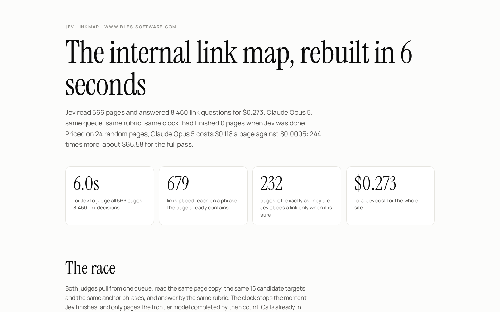
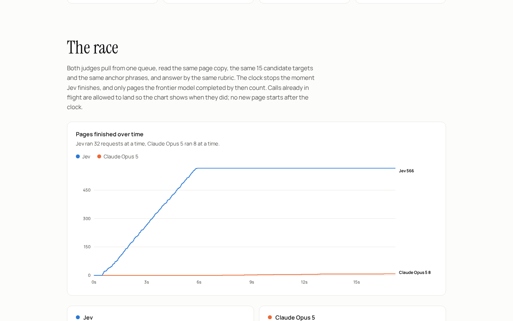
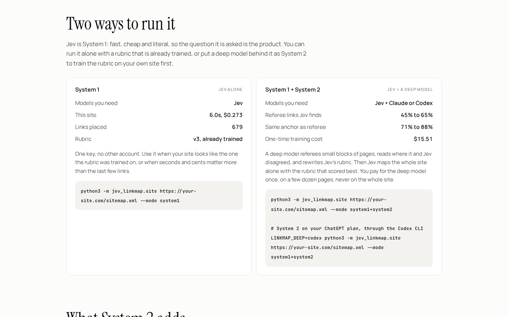

# jev-linkmap

Rebuild a whole site's internal link map in seconds with [Jev](https://typesafe.ai). Run Jev alone (System 1), or put Claude or Codex behind it as System 2 to train its rubric on your site. Includes a race against Claude Opus 5 on the same queue.

Inspired by [borja's post](https://x.com/borjafat/status/2101018783976722479): internal linking is not writing, it is thousands of yes/no calls. Does this page have a real reason to link to that one, and is there anchor text already sitting in the copy. That is a classification problem, so it goes to a decision model, not a frontier writer.

[](https://stas4000.github.io/jev-linkmap/)

Live report: https://stas4000.github.io/jev-linkmap/ · The race as a 22 second film: [video/jev-linkmap-race.mp4](video/jev-linkmap-race.mp4), built frame by frame from the real timings (`video/spec.cjs`).

## The run in this repo

Site: www.bles-software.com, 566 pages, 8,460 link decisions (15 candidate targets per page). Run on 19 Sep 2026. Every number below is from the run files in `out/` and `runs/`.

| | Jev (`typesafe/jev-1.13`) | Claude Opus 5 |
|---|---|---|
| Pages finished when Jev was done | 566 | 0 |
| Wall clock | 5.95 s, 32 requests at a time | first 8 pages landed by 16.5 s, 8 at a time |
| Cost per page | $0.00048 | $0.118 (24 random pages, same rubric) |
| Whole site | **$0.27** | about $67 |
| Links placed | 679 on 334 pages | |
| Pages left as they are | 232, Jev links only when it is sure | |

Per page Jev is about 240 times cheaper. Crawling (17.6 s, 8 polite workers) and building the candidate queue (about 50 s of plain Python) are code, not model time, and are outside the race clock for both judges.



## How it works

1. **Code reads the site.** `crawl.py` walks the sitemap and keeps title, headings, body copy without nav and footer, and the links each page already has. Standard library only.
2. **Code does the search.** `candidates.py` picks the 15 most similar pages each page does not link to yet (TF-IDF cosine), and for each one the 2 to 6 word phrases **already in the copy** that could carry the link. Text that is already a link is never offered. Nothing is written, so every anchor is the author's own words.
3. **Jev does the judging.** One request per page carries the copy once and 30 questions: for each target a yes/no probability (should this page link there) and a multiple choice (which phrase is the honest anchor, or none). About half a second and $0.0005 a page.
4. **Code places the links.** A link exists only when the link probability clears the threshold and the anchor choice is not "none" with enough confidence. At most 3 new links per page, best first, each phrase used once. A page where nothing clears the bar is left as it is, and that is a feature.
5. **The race.** Opus 5 pulls from the same queue with the same copy, targets, anchor options and rubric, through the `claude` CLI. The clock stops when Jev finishes. Calls in flight may land (marked late, never counted) so the chart shows when they did.

## Two ways to run it

Python 3.11+, no dependencies. `JEV_API_KEY` is an OpenRouter key (Jev is served at `openrouter.ai/api/alpha/decisions`); a direct TypeSafe key works with `JEV_URL=https://api.typesafe.ai/v1/systemone`.

### 1. System 1: Jev alone

Jev with a rubric that is already trained (`rubrics/v3.json`). One key, no other account, seconds and cents.

```bash
export JEV_API_KEY=sk-or-...
python3 -m jev_linkmap.site https://your-site.com/sitemap.xml --mode system1
```

You get `out/linkmap.csv` (source, anchor, target, confidence, sentence) and `out/report.html`.

### 2. System 1 + System 2: Jev plus a deep model

Jev is fast and literal. It does exactly what the question says, so the question is the product. In this mode a deep model referees small blocks of pages with no clock, reads the rows where it and Jev disagreed, decides who was right, and rewrites the rubric: question wording, up to 6 one-line lessons, the two thresholds. Every version is scored on a held-out block, and Jev then maps the whole site alone with the best one. Jev never sees the deep model's prose, only the new rubric. You pay for the deep model once, on a few dozen pages, never on the whole site.

```bash
# System 2 through the Claude Code CLI (default): Opus 5 referees, Fable 5.1 rewrites the rubric
python3 -m jev_linkmap.site https://your-site.com/sitemap.xml --mode system1+system2

# System 2 through the Codex CLI, on your ChatGPT plan
LINKMAP_DEEP=codex python3 -m jev_linkmap.site https://your-site.com/sitemap.xml --mode system1+system2

# or the Anthropic API
LINKMAP_DEEP=api ANTHROPIC_API_KEY=... python3 -m jev_linkmap.site https://your-site.com/sitemap.xml --mode system1+system2
```

The Codex link runs `codex exec` in a read-only sandbox inside an empty folder: text in, text out. `CODEX_MODEL` picks a model, otherwise your Codex config decides. Codex reports no dollar cost, so its meters carry time only.

What System 2 added in this repo's run, each rubric scored on one held-out block of 24 pages (360 decisions) that no version was written from:

| Rubric | Same call as referee | Jev links the referee confirms | Referee links Jev found | Same anchor |
|---|---|---|---|---|
| v1, System 1 with a hand-written rubric | 81% | 83% | 45% | 71% |
| v2, after one System 2 pass | 82% | 84% | 55% | 70% |
| v3, after two System 2 passes | 84% | 83% | 65% | 88% |

Two rewrites moved Jev from finding 45% of the referee's links to 65% and from 71% to 88% anchor agreement, with precision holding at 83%. The whole loop (referee blocks plus two rewrites) cost $15.51 once. The rubrics are in `rubrics/`.



The referee is a strong reader, not ground truth, and Jev stays more conservative than it: on the held-out block Jev placed 92 links where the referee placed 117.

## Before you ship: the editor pass

```bash
python3 -m jev_linkmap.verify        # or: jev_linkmap.site ... --verify
```

A deep model reads only the links Jev placed, twenty to a call, and keeps or cuts each one. It can never add a link or change an anchor. In this run it read 679 links for $2.07 and kept 287 (`out/linkmap-verified.csv`), cutting headings, mid-clause fragments and bare product names. Those links are live on www.bles-software.com: the map is one JSON file, and the same function wraps the anchor in the prerendered HTML and in the React page, so the CMS content is never edited.

The race on its own:

```bash
python3 -m jev_linkmap.run race --rubric rubrics/v3.json     # Jev against the deep model, same queue, same clock
```

## Files

- `out/report.html`: the race, the two ways to run it and the searchable link map in one page. `out/linkmap.csv`: every link Jev placed. `out/linkmap-verified.csv`: the ones the editor kept.
- `jev_linkmap/deep.py`: the one place that talks to Claude, Codex or the Anthropic API.
- `out/report.json`, `runs/*/block.json`: the meters every number above comes from.
- `tests/`: `python3 -m unittest discover -s tests`. APIs are mocked.

MIT. Built by [Bles Software](https://www.bles-software.com/).
